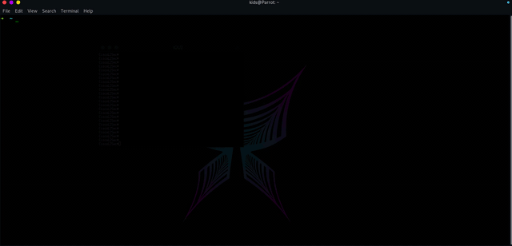

# CiscoL2Sec Python Network Security Automation Script

  

   
   
    
    
    

This Is The Network Security Automation Script For Spoofing Attack Prevention In Cisco Layer 2 Switch

# Developer: AmirHosein Tangsiri Nezhad

## installation:
➜  ~ git clone https://github.com/AmirHoseinTangsiriNET/CiscoL2Sec/

➜  ~ cd CiscoL2Sec

➜  ~ python Cisco2Sec.py

## Attack That This Script Can Prevent And Script Features:

- DHCP Spoofing Attack

- DHCP Starvation Attack 

- Arp Spoofing Attack

- Arp Cache Poisoning Attack

- Mac Table OverFlow Attack

- Spanning Tree loop Mitigation

- Traffic Bogus Mitigation

- Protected Port 
If you configure a port as protected, data traffic on Layer 2 is not transfered to other protected ports on this broadcast domain ( or switch stack). Only control traffic is sent to these ports

## Prerequisite
* Python 
* sys
* telnetlib
* colorama
* time

